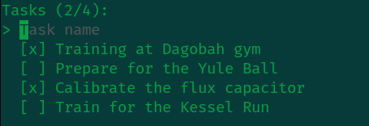

# Togo
> Stupid Simple todo-list app

Most to-do list apps are full-featured tools. I found them distracting so I needed something simpler, like paper and pen, but on my laptop. This tool replicates the simplicity of writing tasks in a notebook for a work session.



### **Controls**  
- `Arrows` to move up and down
- `Enter` to create a task on the task input
- `Enter` to mark a task as done
- `Backspace` to errase a task
- `Ctrl+C` to close

### **Saved tasks**  
Tasks are saved at `$HOME/.config/togo/tasks.json`

### **Task format**  
```
{
    "task" : string,
    "completed" : bool
}
```

### Built with Bubbletea

[Bubbletea github](github.com/charmbracelet/bubbletea)
